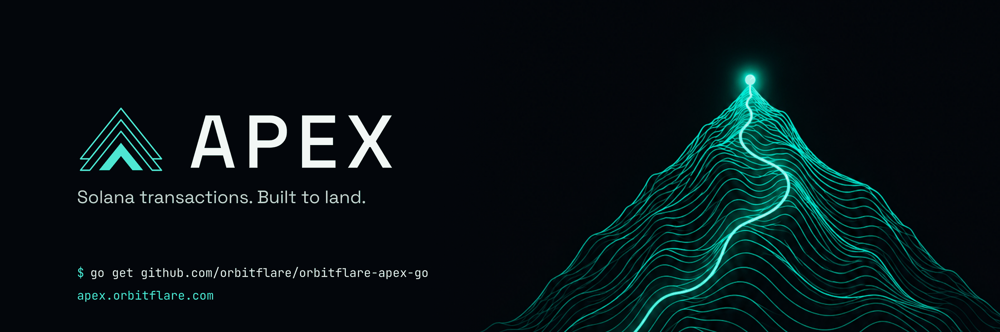

<p align="center">
  <a href="https://apex.orbitflare.com"></a>
</p>

<p align="center">
  <a href="https://pkg.go.dev/github.com/orbitflare/orbitflare-apex-go"></a>
  <a href="https://go.dev/dl/"></a>
  <a href="https://docs.orbitflare.com/apex/go-client"></a>
  <a href="https://apex.orbitflare.com"></a>
</p>

# orbitflare-apex-go

The official Go client for [OrbitFlare Apex](https://apex.orbitflare.com), the
Solana transaction landing service. One tip, three transports, and the
endpoint races every transaction to the leaders through stake-weighted
validator clients, Jito bundles and the leader TPUs at once.

It has the same features as the Rust crate
[`orbitflare-apex`](https://crates.io/crates/orbitflare-apex), the same wire
format and the same client certificate, byte for byte. See the
[docs](https://docs.orbitflare.com/apex/go-client) for examples of every route.

- **QUIC**: one persistent connection per endpoint, a client certificate
  derived from your API key (the key itself never crosses the wire), one
  serialized transaction per stream, 0-RTT reconnects. Fire-and-forget on a
  unidirectional stream, or a bidirectional stream for an inline
  accepted or rejected answer.
- **JSON-RPC**: Solana's `sendTransaction` with an `x-api-key` header, for
  existing code.
- **Plain HTTP**: `POST /send-bin` with the raw transaction bytes (no base64,
  no JSON), `POST /send-batch` for up to 16 at once, `POST /send-bundle` for
  atomic bundles, `GET /ping` to keep a connection warm.

The tip is an instruction inside your transaction, so it is only paid when
the transaction lands. No landing, no cost.

## Install

```
go get github.com/orbitflare/orbitflare-apex-go
```

Go 1.26 or newer. Transactions are built with
[`solana-go`](https://github.com/gagliardetto/solana-go), which covers legacy,
v0 and v1 (SIMD-0385) messages.

## Quick start

```go
package main

import (
	"context"
	"log"
	"time"

	"github.com/gagliardetto/solana-go"

	apex "github.com/orbitflare/orbitflare-apex-go"
	"github.com/orbitflare/orbitflare-apex-go/rpc"
)

func main() {
	ctx := context.Background()
	payer, _ := solana.PrivateKeyFromSolanaKeygenFile("payer.json")

	client, err := apex.Connect(ctx, apex.Frankfurt, "your-api-key")
	if err != nil {
		log.Fatal(err)
	}
	defer client.Close()

	tipAccounts, err := rpc.New(apex.Frankfurt, "your-api-key").GetTipAccounts(ctx)
	if err != nil {
		log.Fatal(err)
	}
	tipAccount, _ := apex.PickTipAccount(tipAccounts)

	solanaRPC := rpc.NewSolanaRPC("https://api.mainnet-beta.solana.com")
	blockhash, err := solanaRPC.LatestBlockhash(ctx)
	if err != nil {
		log.Fatal(err)
	}

	tx, err := solana.NewTransaction([]solana.Instruction{
		yourInstruction,
		apex.TipInstruction(payer.PublicKey(), tipAccount, apex.MinTipLamports),
	}, blockhash, solana.TransactionPayer(payer.PublicKey()))
	if err != nil {
		log.Fatal(err)
	}
	tx.Sign(func(solana.PublicKey) *solana.PrivateKey { return &payer })

	signature, err := client.SendTransaction(ctx, tx)
	if err != nil {
		log.Fatal(err)
	}
	slot, landed, err := solanaRPC.Confirm(ctx, signature.String(), 30*time.Second)
	log.Println(signature, slot, landed, err)
}
```

`SendTransaction` returns once the transaction is on the stream, in
microseconds, with no acknowledgement. Confirm landing on any Solana RPC.

## Endpoints

| Region | Constant | Code | Host |
|---|---|---|---|
| Frankfurt | `apex.Frankfurt` | `fra` | `fra.apex.orbitflare.com` |
| Amsterdam | `apex.Amsterdam` | `ams` | `ams.apex.orbitflare.com` |
| Dublin | `apex.Dublin` | `dub` | `dub.apex.orbitflare.com` |
| London | `apex.London` | `lon` | `lon.apex.orbitflare.com` |
| New York | `apex.NewYork` | `nyc` | `nyc.apex.orbitflare.com` |
| Salt Lake City | `apex.SaltLakeCity` | `slc` | `slc.apex.orbitflare.com` |
| Singapore | `apex.Singapore` | `sgp` | `sgp.apex.orbitflare.com` |
| Tokyo | `apex.Tokyo` | `tyo` | `tyo.apex.orbitflare.com` |
| Siauliai | `apex.Siauliai` | `sqq` | `sqq.apex.orbitflare.com` |
| Global (nearest) | `apex.Global` | `global` | `global.apex.orbitflare.com` |

JSON-RPC and the plain HTTP routes are on port 80; QUIC is UDP 7001.
`apex.ParseRegion("fra")` and `Region.Code()` map to and from the short
codes, and also accept city names.

The HTTP routes are plain HTTP, like other Solana senders. Your API key and
transactions are readable by anyone on the network path. Prefer QUIC, where
the key never leaves your machine, or send HTTP only from a network you
trust. Rotate the key from the dashboard if you think it was exposed.

Pick the endpoint nearest to you, or `apex.Global`, which resolves to the
nearest one. Every endpoint knows the full leader schedule and routes each
transaction to the validator clients nearest the upcoming leaders, so the
choice affects your round trip, not the landing path. Use a named region
when you need a fixed host, for a firewall rule or a pinned round trip.

## Transports

| | QUIC uni | QUIC bidi | HTTP binary | JSON-RPC |
|---|---|---|---|---|
| Call | `SendTransaction`, `SendTransactionBytes` | `SendTransactionWithResponse`, `SendWithResponse` | `rpc.Client.SendTransactionBinary`, `SendBatch` | `rpc.Client.SendTransaction` |
| Returns | the signature; nothing is read back | accepted, or a rejection code and message | the signature, or a JSON error with a label | the signature, or a JSON-RPC error |
| Cost per send | one stream on a warm connection | one stream plus one round trip | an HTTP request, raw bytes, no encoding | an HTTP request, base64 in JSON |
| Best for | bots on a persistent connection | integration and debugging, the reason inline | any language over HTTP, batches | drop-in for `sendTransaction` code |

The transport does not change priority or routing; the tip does.

A send that fails because the connection is gone reconnects (0-RTT when a
session ticket is cached) and retries once. Set `DisableAutoReconnect` in
`apex.Options` to handle that yourself.

## Authentication and keep-alive

Nothing is authenticated per request on QUIC. Your API key never leaves your
machine: it derives an ed25519 key with HKDF-SHA256, the client presents it in
a Solana-style self-signed certificate during the handshake, and every stream
on that connection is yours from then on. `apex.ClientPubkey(apiKey)` returns
that key; it must match the client pubkey shown next to the key on your
dashboard. The connection stays open with a QUIC PING every second, so a send
is one stream open and one write on a warm connection.

If the connection drops, the client reconnects with a session ticket and sends
the waiting transaction in the handshake's first flight (0-RTT), and resends
it if the endpoint declines the early data. A background goroutine
re-handshakes as soon as a drop is noticed, so the next send does not pay for
it. If the endpoint itself closed the connection (unknown key, too many
connections), the goroutine doubles its wait after each attempt, up to 30 s,
instead of hammering the endpoint. Set `DisableProactiveReconnect` to turn it
off; the next send then reconnects instead. `Health()`, `ReconnectsTotal()`
and `ZeroRTTResumptionsTotal()` show what happened.

Each reconnect looks the host name up again, so a client on `apex.Global`
follows the load balancer to the next nearest endpoint when its own one goes
down, without a restart. The lookup happens in that background reconnect, not
on a send, and if it fails or takes more than two seconds the client keeps the
address it had. An IP address endpoint is never looked up.

A `Client` is safe for concurrent use; share one per endpoint and send from as
many goroutines as you like. Call `Close` when you are done, which stops the
background goroutine and closes the socket.

## Tips

Every transaction carries exactly one top-level SystemProgram transfer to one
of the published tip accounts, funded by a signer, with the tip account in the
static account keys (not through a lookup table). The floor depends on your
key's tier; the standard tier is `apex.MinTipLamports` (0.001 SOL). A
transaction without a tip, or below your floor, is rejected before it is sent
anywhere; the bidirectional stream and JSON-RPC tell you which.
`apex.TipInstruction` builds the transfer and `apex.PickTipAccount` picks an
account at random.

Take the accounts to tip from `rpc.Client.GetTipAccounts`. On mainnet they are
ten vaults of the tip program `9ig7pd4gqe2m16ACGPbPo4HfMGD3ba38poDhXEayx7EF`,
every one starting with `APeX`. `rpc.FetchVaults` lists every vault of the
program on chain, which is useful to verify a published account but is not the
published list: anyone can create a vault, and the endpoint rejects tips to
unpublished ones.

v1 transactions carry the compute budget in the message's
`solana.TransactionConfig`, not in ComputeBudget instructions, and every limit
left unset is 0. Set the compute unit limit, the loaded accounts data size
limit and, for priority, the fee. `examples/internal/common` shows both the
legacy and the v1 form.

## Bundles

`rpc.Client.SendBundle` sends one to four transactions that land in order, all
or nothing. Exactly one of them carries the tip, at or above your floor.
Bundles travel the block-engine path only, so they land on Jito-enabled
leaders. Each member takes the same size as a single transaction: up to 4096
bytes as v1, 1232 as legacy or v0. The endpoint resubmits until the bundle
lands or the first transaction's blockhash expires; `BundleStatuses` reports
Pending, Landed with the slot, Failed or Invalid.

## Examples

All examples read `APEX_API_KEY`, `KEYPAIR_PATH` (default `payer.json`),
`SOLANA_RPC_URL`, and optionally `APEX_REGION` (a code from the table above),
`APEX_QUIC`, `APEX_RPC`, `TIP_LAMPORTS`, `APEX_TX_VERSION` (`legacy` or `v1`),
`APEX_MEMO_BYTES` and `APEX_CU_LIMIT`. Each sends a tipped memo and reports the
slot it landed in.

| Example | Shows |
|---|---|
| `quic_send` | Unidirectional stream: the fastest path, then confirmation from a Solana RPC |
| `quic_send_with_response` | Bidirectional stream: the accepted or rejected answer and how to read a rejection |
| `rpc_send` | JSON-RPC `sendTransaction` over HTTP with the same tip rule |
| `http_binary` | `/ping`, `/send-bin` with raw bytes, and a `/send-batch` of three |
| `raw_bytes` | Pre-serialized bytes on the wire, and the exact packet layout |
| `throughput` | One warm connection, N concurrent sends, per-send p50 and p99, landing count |
| `bundle` | An atomic bundle of two transactions, one tipped, and its status until it lands |
| `transfer` | A tipped SOL transfer to `TO` of `LAMPORTS`, legacy or v1, with the admission answer and the landing slot |
| `client_pubkey` | The certificate key an API key derives to, to compare with your dashboard |

```
APEX_API_KEY=... KEYPAIR_PATH=payer.json SOLANA_RPC_URL=https://... \
  go run ./examples/quic_send

APEX_TX_VERSION=v1 APEX_MEMO_BYTES=1400 APEX_CU_LIMIT=1400000 \
  go run ./examples/quic_send_with_response

go run ./examples/throughput 20
```

## API

| | |
|---|---|
| `apex.Connect(ctx, region, apiKey)` | Connect with an ephemeral local port and the default options |
| `apex.ConnectWithOptions(ctx, opts, apiKey)` | `Endpoint` override, `BindAddr` for firewall allowlists, `ConnectTimeout` 3 s, `SendTimeout` 2 s, `KeepAlive` 1 s, `MEVProtect`, `MaxRetries`, `DisableAutoReconnect`, `DisableProactiveReconnect` |
| `SendTransaction(ctx, tx)` | Serialize (legacy, v0 or v1) and send on a unidirectional stream; returns the first signature |
| `SendTransactionBytes(ctx, wire)` | The same with bytes you already hold |
| `SendTransactionWithResponse(ctx, tx)` | Bidirectional stream; a `*apex.RejectedError` with the code and message on rejection |
| `SendWithResponse(ctx, wire)` | The same with bytes; returns the raw `apex.Admission` |
| `Health()`, `ReconnectsTotal()`, `ZeroRTTResumptionsTotal()`, `RemoteAddr()`, `Options()` | Connection state |
| `Reconnect(ctx)`, `Close()` | Lifecycle |
| `apex.TipInstruction`, `apex.PickTipAccount`, `apex.MinTipLamports` | The tip |
| `rpc.Client` | The endpoint over HTTP: `GetTipAccounts`, `SendTransaction` (JSON-RPC), `SendTransactionBinary`, `SendBatch`, `SendBundle`, `BundleStatuses`, `Ping` |
| `rpc.SolanaRPC` | Any Solana RPC: `LatestBlockhash`, `Confirm(ctx, signature, timeout)` |
| `rpc.FetchVaults(ctx, solanaRPCURL)` | Every vault of the tip program on chain, for verification; not the published list |
| `apex.ClientPubkey(apiKey)` | The certificate key your API key derives to, as shown on your dashboard |
| `apex.SerializeTransaction(tx)` | The canonical wire bytes for legacy, v0 and v1 |
| `apex.EncodePacket`, `apex.FrameParts`, `apex.DecodeAdmission` | The wire format |
| `apex.RetryBudget(n)` | A `MaxRetries` value for the options and the HTTP calls |

`MaxRetries` is a `*uint16`: nil leaves the validator clients' default, and
`apex.RetryBudget(3)` sets a budget.

## Limits and errors

| | |
|---|---|
| Transaction size | legacy and v0 up to 1232 bytes, v1 up to 4096; over 4096 is a `*apex.TooLargeError` before anything is sent, an oversized legacy transaction is rejected by the endpoint |
| Packet size | at most 4160 bytes on the stream |
| Idle timeout | the client pings every `KeepAlive` (1 s), well inside the idle timeout |
| Rate limit | per key and tier, `apex.AdmissionRateLimited` or JSON-RPC `-32029` |
| Connections | one client per process and endpoint is enough; streams multiplex on it. Limits: 128 per key, 64 per address |

Errors wrap a sentinel, so `errors.Is` tells you the stage that failed:
`apex.ErrResolve`, `ErrBind`, `ErrConnect`, `ErrConnection`, `ErrWrite`,
`ErrRead`, `ErrTimeout`, `ErrSerialize`, `ErrBadAdmission`, `ErrClosed`,
`ErrNoSignature` and `ErrClientStopped` (a send after `Close`). Use
`errors.As` for `*apex.RejectedError`, `*apex.TooLargeError` and, from the
`rpc` package, `*rpc.Error` with the JSON-RPC code and message.

Plain HTTP routes reply with JSON. Accepted: `{"signature": "..."}` and 200.
Rejected: `{"error": "<label>", "message": "..."}` with 401 (unauthorized), 429
(rate limited), 400 (invalid transaction, tip or size), 408 (the body did not
arrive within 2 s) or 503 (busy); the client returns these as an `*rpc.Error`
with code 0 and the message `label: message`.

Admission codes on the bidirectional stream: `AdmissionOK`,
`AdmissionUnauthorized`, `AdmissionRateLimited`, `AdmissionInvalid` (the
message says what failed sanitization), `AdmissionNoTip`,
`AdmissionBelowFloor` (the message states your floor), `AdmissionBusy`,
`AdmissionMalformedPacket`. JSON-RPC errors: `-32001` unauthorized, `-32029`
rate limited, `-32602` invalid transaction or tip, `-32603` busy.

Accepted means the endpoint holds the transaction and is racing it to the
leaders until it lands or its blockhash expires. It does not mean it landed:
confirm with `rpc.SolanaRPC.Confirm` or `getSignatureStatuses` on any RPC.

## What it does not do

- build or sign transactions, or choose your priority fee
- simulate or preflight (nothing between you and the leader does)
- simulate a bundle before sending it

## Tests

```
go test -race ./...
```

The suite pins the key derivation against the server's test vector, checks
the client certificate byte for byte against `solana-tls-utils`, checks the
packet, batch and admission framing against the Rust crate's vectors, and runs
the QUIC client against a local endpoint that speaks the Apex protocol:
unidirectional and bidirectional sends, rejections, reconnects by the
background goroutine and on send, refusal back-off, 0-RTT resumption and the
resend after a 0-RTT rejection. The HTTP client runs against a local server
that checks every route, header and body.
